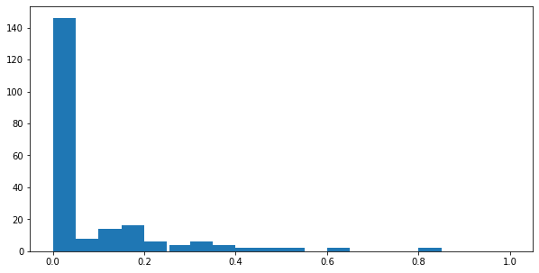
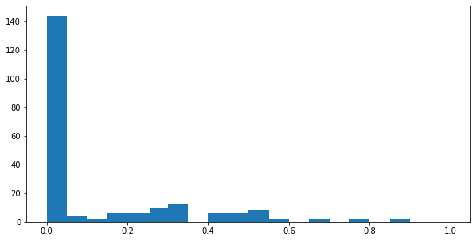

*In progress*

Here, we solve several canonical problems in network analysis: entity resolution (determining when two observations correspond to the same entity), link prediction (inferring the existence of links), and node labeling (inferring hidden attributes).

Updates can be seen here:
- <https://github.com/linqs/collective-graph-identification-refactor>
- <https://github.com/ThachAndrew/psl-examples/tree/collective-graph-identification/collective-graph-identification>


# This notebook stores each step of refactoring the graph data into PSL data


```python
# No space between equals sign is necessary, so we can treat these as Bash variables as well.
FILE_GROUND_TRUTH_EMAIL_NODES='../c3/namata-kdd11-data/enron/enron-samples-lowunk/outputgraph/enron.NODE.email.tab'
FILE_GROUND_TRUTH_COREF_EDGES='../c3/namata-kdd11-data/enron/enron-samples-lowunk/outputgraph/enron.UNDIRECTED.coref.tab'
FILE_GROUND_TRUTH_MANAGES_EDGES='../c3/namata-kdd11-data/enron/enron-samples-lowunk/outputgraph/enron.UNDIRECTED.email-submgr.tab'
FILE_GROUND_TRUTH_COMMUNICATION_EDGES='../c3/namata-kdd11-data/enron/enron-samples-lowunk/outputgraph/enron.DIRECTED.sentto.tab'


FILE_SAMPLE_EMAIL_NODES='../c3/namata-kdd11-data/enron/enron-samples-lowunk/enron-sample-lowunk-6of6/sample-enron.NODE.email.tab'
FILE_SAMPLE_COREF_EDGES='../c3/namata-kdd11-data/enron/enron-samples-lowunk/enron-sample-lowunk-6of6/sample-enron.UNDIRECTED.coref.tab'
FILE_SAMPLE_MANAGES_EDGES='../c3/namata-kdd11-data/enron/enron-samples-lowunk/enron-sample-lowunk-6of6/sample-enron.UNDIRECTED.email-submgr.tab'

```

## These functions help parse the .tab files.


```python
import pandas as pd
import numpy as np
import re
import itertools # for cross products when filling in a full PSL dataset
```


```python
# assigns types to each column
def resolve_column_type(table):
    for column in table.columns:
        if column in {'id', 'email', 'alt_email', 'other_email' , 'numsent', 'numreceived', 'numexchanged'}:
            table[column] = table[column].astype(str).astype(float).astype(int)
        # convert bag-of-words columns to floats (since ints won't take NaNs)
        elif re.match("w-", column):
            table[column] = table[column].astype(str).astype(float)

# extracts feature name from an element in a raw tab row
# returns: tuple (feature_name, feature_value, optional_value)
def get_feature_tuple(feature):
    feature_data = re.split(r"[:=]", feature)
    return feature_data
    

# loads the *.tab files into a Pandas Dataframe.
# returns: pd.DataFrame(columns=features)
def load_table(filename):

    # initialize the pandas dataframe
    node_data = pd.DataFrame()


    with open(filename) as infile:
        i = 0
        row_list = []
        for row in infile:
    
            #print('i is: ', i)

            if i == 0:
                # Skip non-useful first line
                print("Header: ", row)
            elif i == 1:
                # Prepare dataframe column labels
                tokens = row.split()
                if len(tokens) == 1:
                    print("This is not a NODE file, so don't load this row")
                else:  
                    features = ["id"] + [get_feature_tuple(feature)[1] for feature in tokens]
                    node_data = pd.DataFrame(columns=features)
            else:
          
                # this is to help the function generalize among the NODE and EDGE files.
                # EDGE files have a "|" character, which needs to be removed for proper feature decoupling
                row = re.sub(r'\|','', row)
            
                tokens = row.split()

                # the first token doesn't need splitting
                row_dict = {'id':tokens[0]}
                row_dict.update({get_feature_tuple(token)[0]:get_feature_tuple(token)[1] for token in tokens[1:]})
                row_list.append(row_dict)
        
            i += 1
        
        # Fill in rows
        node_data = pd.concat([node_data, pd.DataFrame(row_list)], ignore_index=True)

    return node_data
```

# Process the email nodes

## Get ground truth


```python
email_nodes = load_table(FILE_GROUND_TRUTH_EMAIL_NODES)
# remove the (unnecessary) second to last column (it came from an ambiguous parse splits)
email_nodes.drop('other,manager,specialist,director,executive', axis=1, inplace=True)
resolve_column_type(email_nodes)

email_nodes.dtypes
```

    Header:  NODE	email
    


    id                int64
    emailaddress     object
    numsent           int64
    numreceived       int64
    numexchanged      int64
                     ...   
    w-kinney        float64
    w-veselack      float64
    w-mwhitt        float64
    w-jarnold       float64
    title            object
    Length: 5119, dtype: object


```python
email_nodes
```


<div>
<style scoped>
    .dataframe tbody tr th:only-of-type {
        vertical-align: middle;
    }

    .dataframe tbody tr th {
        vertical-align: top;
    }

    .dataframe thead th {
        text-align: right;
    }
</style>
<table border="1" class="dataframe">
  <thead>
    <tr style="text-align: right;">
      <th></th>
      <th>id</th>
      <th>emailaddress</th>
      <th>numsent</th>
      <th>numreceived</th>
      <th>numexchanged</th>
      <th>w-gerald</th>
      <th>w-know</th>
      <th>w-busi</th>
      <th>w-mexicana</th>
      <th>w-transact</th>
      <th>...</th>
      <th>w-bartlo</th>
      <th>w-columbiagassubject</th>
      <th>w-perron</th>
      <th>w-coh</th>
      <th>w-agl</th>
      <th>w-kinney</th>
      <th>w-veselack</th>
      <th>w-mwhitt</th>
      <th>w-jarnold</th>
      <th>title</th>
    </tr>
  </thead>
  <tbody>
    <tr>
      <th>0</th>
      <td>283</td>
      <td>c..koehler@enron.com</td>
      <td>128</td>
      <td>606</td>
      <td>734</td>
      <td>1.0</td>
      <td>1.0</td>
      <td>1.0</td>
      <td>NaN</td>
      <td>1.0</td>
      <td>...</td>
      <td>NaN</td>
      <td>NaN</td>
      <td>NaN</td>
      <td>NaN</td>
      <td>NaN</td>
      <td>NaN</td>
      <td>NaN</td>
      <td>NaN</td>
      <td>NaN</td>
      <td>director</td>
    </tr>
    <tr>
      <th>1</th>
      <td>98</td>
      <td>scott.goodell@enron.com</td>
      <td>98</td>
      <td>607</td>
      <td>705</td>
      <td>1.0</td>
      <td>1.0</td>
      <td>1.0</td>
      <td>NaN</td>
      <td>1.0</td>
      <td>...</td>
      <td>1.0</td>
      <td>1.0</td>
      <td>1.0</td>
      <td>1.0</td>
      <td>1.0</td>
      <td>1.0</td>
      <td>1.0</td>
      <td>NaN</td>
      <td>NaN</td>
      <td>specialist</td>
    </tr>
    <tr>
      <th>2</th>
      <td>183</td>
      <td>p..south@enron.com</td>
      <td>8</td>
      <td>351</td>
      <td>359</td>
      <td>1.0</td>
      <td>1.0</td>
      <td>1.0</td>
      <td>NaN</td>
      <td>NaN</td>
      <td>...</td>
      <td>NaN</td>
      <td>NaN</td>
      <td>NaN</td>
      <td>NaN</td>
      <td>NaN</td>
      <td>NaN</td>
      <td>NaN</td>
      <td>NaN</td>
      <td>NaN</td>
      <td>director</td>
    </tr>
    <tr>
      <th>3</th>
      <td>204</td>
      <td>lavorato@enron.com</td>
      <td>388</td>
      <td>3</td>
      <td>391</td>
      <td>NaN</td>
      <td>1.0</td>
      <td>1.0</td>
      <td>NaN</td>
      <td>1.0</td>
      <td>...</td>
      <td>NaN</td>
      <td>NaN</td>
      <td>NaN</td>
      <td>NaN</td>
      <td>NaN</td>
      <td>NaN</td>
      <td>NaN</td>
      <td>NaN</td>
      <td>NaN</td>
      <td>executive</td>
    </tr>
    <tr>
      <th>4</th>
      <td>318</td>
      <td>mike.grigsby@enron.com</td>
      <td>3702</td>
      <td>490</td>
      <td>4192</td>
      <td>1.0</td>
      <td>1.0</td>
      <td>1.0</td>
      <td>1.0</td>
      <td>1.0</td>
      <td>...</td>
      <td>NaN</td>
      <td>NaN</td>
      <td>NaN</td>
      <td>NaN</td>
      <td>NaN</td>
      <td>NaN</td>
      <td>NaN</td>
      <td>NaN</td>
      <td>NaN</td>
      <td>executive</td>
    </tr>
    <tr>
      <th>...</th>
      <td>...</td>
      <td>...</td>
      <td>...</td>
      <td>...</td>
      <td>...</td>
      <td>...</td>
      <td>...</td>
      <td>...</td>
      <td>...</td>
      <td>...</td>
      <td>...</td>
      <td>...</td>
      <td>...</td>
      <td>...</td>
      <td>...</td>
      <td>...</td>
      <td>...</td>
      <td>...</td>
      <td>...</td>
      <td>...</td>
      <td>...</td>
    </tr>
    <tr>
      <th>206</th>
      <td>114</td>
      <td>vkamins@enron.com</td>
      <td>0</td>
      <td>12</td>
      <td>12</td>
      <td>NaN</td>
      <td>1.0</td>
      <td>1.0</td>
      <td>NaN</td>
      <td>1.0</td>
      <td>...</td>
      <td>NaN</td>
      <td>NaN</td>
      <td>NaN</td>
      <td>NaN</td>
      <td>NaN</td>
      <td>NaN</td>
      <td>NaN</td>
      <td>NaN</td>
      <td>NaN</td>
      <td>director</td>
    </tr>
    <tr>
      <th>207</th>
      <td>270</td>
      <td>david.duran@enron.com</td>
      <td>7</td>
      <td>145</td>
      <td>152</td>
      <td>NaN</td>
      <td>1.0</td>
      <td>1.0</td>
      <td>NaN</td>
      <td>1.0</td>
      <td>...</td>
      <td>NaN</td>
      <td>NaN</td>
      <td>NaN</td>
      <td>NaN</td>
      <td>NaN</td>
      <td>NaN</td>
      <td>NaN</td>
      <td>NaN</td>
      <td>NaN</td>
      <td>director</td>
    </tr>
    <tr>
      <th>208</th>
      <td>282</td>
      <td>sean.crandall@enron.com</td>
      <td>94</td>
      <td>138</td>
      <td>232</td>
      <td>NaN</td>
      <td>1.0</td>
      <td>1.0</td>
      <td>NaN</td>
      <td>1.0</td>
      <td>...</td>
      <td>NaN</td>
      <td>NaN</td>
      <td>NaN</td>
      <td>NaN</td>
      <td>NaN</td>
      <td>NaN</td>
      <td>NaN</td>
      <td>NaN</td>
      <td>NaN</td>
      <td>director</td>
    </tr>
    <tr>
      <th>209</th>
      <td>243</td>
      <td>kevin.presto@enron.com</td>
      <td>248</td>
      <td>198</td>
      <td>446</td>
      <td>1.0</td>
      <td>1.0</td>
      <td>1.0</td>
      <td>NaN</td>
      <td>1.0</td>
      <td>...</td>
      <td>NaN</td>
      <td>NaN</td>
      <td>NaN</td>
      <td>NaN</td>
      <td>NaN</td>
      <td>NaN</td>
      <td>NaN</td>
      <td>NaN</td>
      <td>NaN</td>
      <td>executive</td>
    </tr>
    <tr>
      <th>210</th>
      <td>131</td>
      <td>dave.fuller@enron.com</td>
      <td>165</td>
      <td>129</td>
      <td>294</td>
      <td>1.0</td>
      <td>1.0</td>
      <td>1.0</td>
      <td>NaN</td>
      <td>1.0</td>
      <td>...</td>
      <td>NaN</td>
      <td>NaN</td>
      <td>NaN</td>
      <td>NaN</td>
      <td>NaN</td>
      <td>NaN</td>
      <td>NaN</td>
      <td>NaN</td>
      <td>NaN</td>
      <td>manager</td>
    </tr>
  </tbody>
</table>
<p>211 rows × 5119 columns</p>
</div>


```python
# Takes a table and fills the missing pairs and values to specify a full, sufficient set
# So far it only works with binary predicates
def fill_observed_missing_possibilities(table, arguments, values):
    total_possibilities = set(itertools.product(list(table[arguments[0]]), values))
    already_observed_possibilities = set((table.loc[index][arguments[0]], table.loc[index][arguments[1]]) for index in table.index)

    missing_possibilities = total_possibilities - already_observed_possibilities
    row_list = []
    for arg_0, arg_1 in missing_possibilities:
        row_dict = {arguments[0]:arg_0, arguments[1]:arg_1, arguments[2]:0 }
        row_list.append(row_dict)
        
    return pd.concat([table, pd.DataFrame(row_list)], ignore_index=True)
```


```python
# Grab necessary columns, in preparation for dumping the whole ground truth data
email_nodes_data = email_nodes[['id','title']].copy()

# convert titles to integers, so PSL can ground faster
title_map = {"other": 0, "manager": 1, "specialist": 2, "director": 3, "executive": 4}

email_nodes_data = email_nodes_data.replace({'title': title_map})
email_nodes_data['exists'] = 1.0

full_set_email_has_label_data = fill_observed_missing_possibilities(email_nodes_data, ['id', 'title', 'exists'], list(title_map.values()))
full_set_email_has_label_data
```


<div>
<style scoped>
    .dataframe tbody tr th:only-of-type {
        vertical-align: middle;
    }

    .dataframe tbody tr th {
        vertical-align: top;
    }

    .dataframe thead th {
        text-align: right;
    }
</style>
<table border="1" class="dataframe">
  <thead>
    <tr style="text-align: right;">
      <th></th>
      <th>id</th>
      <th>title</th>
      <th>exists</th>
    </tr>
  </thead>
  <tbody>
    <tr>
      <th>0</th>
      <td>283</td>
      <td>3</td>
      <td>1.0</td>
    </tr>
    <tr>
      <th>1</th>
      <td>98</td>
      <td>2</td>
      <td>1.0</td>
    </tr>
    <tr>
      <th>2</th>
      <td>183</td>
      <td>3</td>
      <td>1.0</td>
    </tr>
    <tr>
      <th>3</th>
      <td>204</td>
      <td>4</td>
      <td>1.0</td>
    </tr>
    <tr>
      <th>4</th>
      <td>318</td>
      <td>4</td>
      <td>1.0</td>
    </tr>
    <tr>
      <th>...</th>
      <td>...</td>
      <td>...</td>
      <td>...</td>
    </tr>
    <tr>
      <th>1050</th>
      <td>182</td>
      <td>4</td>
      <td>0.0</td>
    </tr>
    <tr>
      <th>1051</th>
      <td>308</td>
      <td>0</td>
      <td>0.0</td>
    </tr>
    <tr>
      <th>1052</th>
      <td>46</td>
      <td>0</td>
      <td>0.0</td>
    </tr>
    <tr>
      <th>1053</th>
      <td>202</td>
      <td>0</td>
      <td>0.0</td>
    </tr>
    <tr>
      <th>1054</th>
      <td>26</td>
      <td>3</td>
      <td>0.0</td>
    </tr>
  </tbody>
</table>
<p>1055 rows × 3 columns</p>
</div>


```python
# Outputs all data (obs+truth)
# full_set_email_has_label_data.to_csv('EmailHasLabel_data.csv', sep ='\t', index=False, header=False, columns=['id', 'title', 'exists'])
```

## Calculate splits for PSL predicates


```python
# Grab the sample from the original experiment, this will allow us to calculate observations and targets.
sample_email_nodes = load_table(FILE_SAMPLE_EMAIL_NODES)
# remove the (unnecessary) second to last column (it came from an ambiguous parse splits)
sample_email_nodes.drop('other,manager,specialist,director,executive', axis=1, inplace=True)
resolve_column_type(sample_email_nodes)
```

    Header:  NODE	email
    


```python
# Split data into observed and targets (AKA train and test)
email_nodes_obs = email_nodes[email_nodes['id'].isin(sample_email_nodes[sample_email_nodes['title'].notna()]['id'])]
email_nodes_truth = email_nodes[email_nodes['id'].isin(sample_email_nodes[sample_email_nodes['title'].isna()]['id'])]
```


```python
# Grab the necessary columns
email_has_label_obs = email_nodes_obs[['id','title']].copy()
email_has_label_truth = email_nodes_truth[['id','title']].copy()

# convert titles to integers, so PSL can ground faster
email_has_label_obs = email_has_label_obs.replace({'title': title_map})
email_has_label_truth = email_has_label_truth.replace({'title': title_map})

# add in an existence column
email_has_label_obs['exists'] = 1.0
email_has_label_truth['exists'] = 1.0

# email_has_label_obs
```


```python
# Add in the the non existent observations
full_set_email_has_label_obs = fill_observed_missing_possibilities(email_has_label_obs, ['id', 'title', 'exists'], list(title_map.values()))
full_set_email_has_label_truth = fill_observed_missing_possibilities(email_has_label_truth, ['id', 'title', 'exists'], list(title_map.values()))
```


```python
# Outputs splits to file
full_set_email_has_label_obs.to_csv('EmailHasLabel_obs.csv', sep ='\t', index=False, header=False)
full_set_email_has_label_truth.to_csv('EmailHasLabel_truth.csv', sep ='\t', index=False, header=False)
```

# Process the CoRef edges

## Get ground truth


```python
# need to rename one of the columns due to key collision
# use copy for safety

!cp $FILE_GROUND_TRUTH_COREF_EDGES .
!sed -i 's/email/alt_email/2g' enron.UNDIRECTED.coref.tab

coref_edges = load_table('enron.UNDIRECTED.coref.tab')
resolve_column_type(coref_edges)

coref_edges.dtypes
```

    Header:  UNDIRECTED	coref
    
    This is not a NODE file, so don't load this row


    id            int64
    email         int64
    alt_email     int64
    exists       object
    dtype: object


```python
coref_edges
```


<div>
<style scoped>
    .dataframe tbody tr th:only-of-type {
        vertical-align: middle;
    }

    .dataframe tbody tr th {
        vertical-align: top;
    }

    .dataframe thead th {
        text-align: right;
    }
</style>
<table border="1" class="dataframe">
  <thead>
    <tr style="text-align: right;">
      <th></th>
      <th>id</th>
      <th>email</th>
      <th>alt_email</th>
      <th>exists</th>
    </tr>
  </thead>
  <tbody>
    <tr>
      <th>0</th>
      <td>2856</td>
      <td>265</td>
      <td>141</td>
      <td>NOTEXIST</td>
    </tr>
    <tr>
      <th>1</th>
      <td>18491</td>
      <td>310</td>
      <td>295</td>
      <td>NOTEXIST</td>
    </tr>
    <tr>
      <th>2</th>
      <td>516</td>
      <td>272</td>
      <td>183</td>
      <td>NOTEXIST</td>
    </tr>
    <tr>
      <th>3</th>
      <td>5131</td>
      <td>201</td>
      <td>19</td>
      <td>NOTEXIST</td>
    </tr>
    <tr>
      <th>4</th>
      <td>12417</td>
      <td>138</td>
      <td>78</td>
      <td>NOTEXIST</td>
    </tr>
    <tr>
      <th>...</th>
      <td>...</td>
      <td>...</td>
      <td>...</td>
      <td>...</td>
    </tr>
    <tr>
      <th>20776</th>
      <td>15003</td>
      <td>135</td>
      <td>208</td>
      <td>NOTEXIST</td>
    </tr>
    <tr>
      <th>20777</th>
      <td>4450</td>
      <td>197</td>
      <td>47</td>
      <td>NOTEXIST</td>
    </tr>
    <tr>
      <th>20778</th>
      <td>20302</td>
      <td>248</td>
      <td>25</td>
      <td>NOTEXIST</td>
    </tr>
    <tr>
      <th>20779</th>
      <td>12985</td>
      <td>222</td>
      <td>118</td>
      <td>NOTEXIST</td>
    </tr>
    <tr>
      <th>20780</th>
      <td>19684</td>
      <td>248</td>
      <td>54</td>
      <td>NOTEXIST</td>
    </tr>
  </tbody>
</table>
<p>20781 rows × 4 columns</p>
</div>


```python
# Grab necessary columns, in preparation for dumping the whole ground truth data
coref_edges_data = coref_edges[['email','alt_email', 'exists']].copy()

# convert existence column to boolean, so PSL can ground faster
exists_map = {"NOTEXIST": 0.0, "EXIST": 1.0}
coref_edges_data = coref_edges_data.replace({'exists': exists_map})

# Since it's undirected, add in the reverse edges.
coref_edges_data_sym = coref_edges_data[['alt_email', 'email', 'exists']].copy()
coref_edges_data_sym.rename(columns = {'alt_email':'email', 'email':'alt_email'}, inplace = True)

coref_edges_data = pd.concat([coref_edges_data, coref_edges_data_sym])

# Calculated the missing edges that were blocked.
missing_edges = {pair for pair in itertools.permutations(email_nodes['id'], 2)} - {pair for pair in zip(coref_edges_data['email'], coref_edges_data['alt_email'])}

# add in the missing edges
row_list = []
for email, alt_email in missing_edges:
    row_dict = {'email':email, 'alt_email':alt_email, 'exists':0 }
    row_list.append(row_dict)

full_set_coref_edges_data = pd.concat([coref_edges_data, pd.DataFrame(row_list)], ignore_index=True)
```


```python
# Outputs to file
# full_set_coref_edges_data.to_csv('CoRef_data.csv', sep ='\t', index=False, header=False, columns=['email', 'alt_email', 'exists'])
```


```python
# Sanity Check: These should print pairs of the same people
# for index in full_set_coref_edges_data[full_set_coref_edges_data['exists'] == 1.0][['email', 'alt_email']].index:
#     email_id  = full_set_coref_edges_data.loc[index]['email'].iloc[0]
#     alt_email_id = full_set_coref_edges_data.loc[index]['alt_email'].iloc[0]
    
#     print(email_nodes[email_nodes['id'] == email_id]['emailaddress'])
#     print(email_nodes[email_nodes['id'] == alt_email_id]['emailaddress'])
#     print("------------------------------------------------")
    
```

## Calculate splits for PSL predicates


```python
# Grab the sample from the original experiment, this will allow us to calculate observations and targets.
sample_coref_edges = load_table(FILE_SAMPLE_COREF_EDGES)
resolve_column_type(sample_coref_edges)

```

    Header:  UNDIRECTED	coref
    
    This is not a NODE file, so don't load this row


```python
# Split data into observed and targets (AKA train and test)
coref_edges_obs = coref_edges[coref_edges['id'].isin(sample_coref_edges[sample_coref_edges['exists'].notna()]['id'])]
coref_edges_truth = coref_edges[coref_edges['id'].isin(sample_coref_edges[sample_coref_edges['exists'].isna()]['id'])]
```


```python
# Grab the necessary columns
coref_obs = coref_edges_obs[['email', 'alt_email', 'exists']].copy()
coref_truth = coref_edges_truth[['email', 'alt_email', 'exists']].copy()

# convert existence column to boolean, so PSL can ground faster
coref_obs = coref_obs.replace({'exists': exists_map})
coref_truth = coref_truth.replace({'exists': exists_map})

# Since it's undirected, add in the reverse edges.
coref_obs_sym = coref_obs[['alt_email', 'email', 'exists']].copy()
coref_truth_sym = coref_truth[['alt_email', 'email', 'exists']].copy()

coref_obs_sym.rename(columns = {'alt_email':'email', 'email':'alt_email'}, inplace = True)
coref_truth_sym.rename(columns = {'alt_email':'email', 'email':'alt_email'}, inplace = True)

coref_obs = pd.concat([coref_obs, coref_obs_sym], ignore_index=True)
coref_truth = pd.concat([coref_truth, coref_truth_sym], ignore_index=True)

# Calculated the missing edges that were blocked. Note the last set prevents cross contamination
missing_edges = {pair for pair in itertools.permutations(email_nodes['id'], 2)} - {pair for pair in zip(coref_obs['email'], coref_obs['alt_email'])} - {pair for pair in zip(coref_truth['email'], coref_truth['alt_email'])}

# add in the missing edges
row_list = []
for email, alt_email in missing_edges:
    row_dict = {'email':email, 'alt_email':alt_email, 'exists':0 }
    row_list.append(row_dict)

full_set_coref_edges_obs = pd.concat([coref_obs, pd.DataFrame(row_list)], ignore_index=True)
```


```python
# Outputs splits to file
full_set_coref_edges_obs.to_csv('CoRef_obs.csv', sep ='\t', index=False, header=False, columns=['email', 'alt_email', 'exists'])
coref_truth.to_csv('CoRef_truth.csv', sep ='\t', index=False, header=False, columns=['email', 'alt_email', 'exists'])
```

# Process the Manager edges

## Get ground truth


```python
# Load in the observed email-submgr.
# need to rename one of the columns due to key collision
# use copy for safety
!cp $FILE_GROUND_TRUTH_MANAGES_EDGES .
!sed -i 's/\temail/\tother_email/2g' enron.UNDIRECTED.email-submgr.tab

manager_edges = load_table('enron.UNDIRECTED.email-submgr.tab')

# FIXME: can probably omit this line
manager_edges.drop('NOTEXIST,EXIST', axis=1, inplace=True)

resolve_column_type(manager_edges)

manager_edges.dtypes
```

    Header:  UNDIRECTED	email-submgr
    


    id                int64
    w-gerald        float64
    w-know          float64
    w-busi          float64
    w-mexicana      float64
                     ...   
    w-jarnold       float64
    numexchanged      int64
    email             int64
    other_email       int64
    exists           object
    Length: 5118, dtype: object


```python
manager_edges
```


<div>
<style scoped>
    .dataframe tbody tr th:only-of-type {
        vertical-align: middle;
    }

    .dataframe tbody tr th {
        vertical-align: top;
    }

    .dataframe thead th {
        text-align: right;
    }
</style>
<table border="1" class="dataframe">
  <thead>
    <tr style="text-align: right;">
      <th></th>
      <th>id</th>
      <th>w-gerald</th>
      <th>w-know</th>
      <th>w-busi</th>
      <th>w-mexicana</th>
      <th>w-transact</th>
      <th>w-want</th>
      <th>w-thing</th>
      <th>w-review</th>
      <th>w-questar</th>
      <th>...</th>
      <th>w-coh</th>
      <th>w-agl</th>
      <th>w-kinney</th>
      <th>w-veselack</th>
      <th>w-mwhitt</th>
      <th>w-jarnold</th>
      <th>numexchanged</th>
      <th>email</th>
      <th>other_email</th>
      <th>exists</th>
    </tr>
  </thead>
  <tbody>
    <tr>
      <th>0</th>
      <td>2693</td>
      <td>NaN</td>
      <td>1.0</td>
      <td>NaN</td>
      <td>NaN</td>
      <td>1.0</td>
      <td>1.0</td>
      <td>NaN</td>
      <td>1.0</td>
      <td>NaN</td>
      <td>...</td>
      <td>NaN</td>
      <td>NaN</td>
      <td>NaN</td>
      <td>NaN</td>
      <td>NaN</td>
      <td>NaN</td>
      <td>6</td>
      <td>286</td>
      <td>324</td>
      <td>EXIST</td>
    </tr>
    <tr>
      <th>1</th>
      <td>2634</td>
      <td>NaN</td>
      <td>1.0</td>
      <td>NaN</td>
      <td>NaN</td>
      <td>NaN</td>
      <td>1.0</td>
      <td>NaN</td>
      <td>NaN</td>
      <td>NaN</td>
      <td>...</td>
      <td>NaN</td>
      <td>NaN</td>
      <td>NaN</td>
      <td>NaN</td>
      <td>NaN</td>
      <td>NaN</td>
      <td>3</td>
      <td>74</td>
      <td>37</td>
      <td>NOTEXIST</td>
    </tr>
    <tr>
      <th>2</th>
      <td>1256</td>
      <td>NaN</td>
      <td>1.0</td>
      <td>1.0</td>
      <td>NaN</td>
      <td>NaN</td>
      <td>1.0</td>
      <td>1.0</td>
      <td>1.0</td>
      <td>NaN</td>
      <td>...</td>
      <td>NaN</td>
      <td>NaN</td>
      <td>NaN</td>
      <td>NaN</td>
      <td>NaN</td>
      <td>NaN</td>
      <td>14</td>
      <td>148</td>
      <td>131</td>
      <td>NOTEXIST</td>
    </tr>
    <tr>
      <th>3</th>
      <td>1406</td>
      <td>NaN</td>
      <td>NaN</td>
      <td>NaN</td>
      <td>NaN</td>
      <td>1.0</td>
      <td>1.0</td>
      <td>NaN</td>
      <td>NaN</td>
      <td>NaN</td>
      <td>...</td>
      <td>NaN</td>
      <td>NaN</td>
      <td>NaN</td>
      <td>NaN</td>
      <td>NaN</td>
      <td>NaN</td>
      <td>3</td>
      <td>57</td>
      <td>313</td>
      <td>EXIST</td>
    </tr>
    <tr>
      <th>4</th>
      <td>3129</td>
      <td>NaN</td>
      <td>1.0</td>
      <td>1.0</td>
      <td>NaN</td>
      <td>1.0</td>
      <td>1.0</td>
      <td>1.0</td>
      <td>1.0</td>
      <td>NaN</td>
      <td>...</td>
      <td>NaN</td>
      <td>NaN</td>
      <td>NaN</td>
      <td>NaN</td>
      <td>NaN</td>
      <td>NaN</td>
      <td>43</td>
      <td>34</td>
      <td>236</td>
      <td>NOTEXIST</td>
    </tr>
    <tr>
      <th>...</th>
      <td>...</td>
      <td>...</td>
      <td>...</td>
      <td>...</td>
      <td>...</td>
      <td>...</td>
      <td>...</td>
      <td>...</td>
      <td>...</td>
      <td>...</td>
      <td>...</td>
      <td>...</td>
      <td>...</td>
      <td>...</td>
      <td>...</td>
      <td>...</td>
      <td>...</td>
      <td>...</td>
      <td>...</td>
      <td>...</td>
      <td>...</td>
    </tr>
    <tr>
      <th>2046</th>
      <td>2105</td>
      <td>NaN</td>
      <td>1.0</td>
      <td>NaN</td>
      <td>NaN</td>
      <td>1.0</td>
      <td>NaN</td>
      <td>NaN</td>
      <td>1.0</td>
      <td>NaN</td>
      <td>...</td>
      <td>NaN</td>
      <td>NaN</td>
      <td>NaN</td>
      <td>NaN</td>
      <td>NaN</td>
      <td>NaN</td>
      <td>13</td>
      <td>67</td>
      <td>288</td>
      <td>NOTEXIST</td>
    </tr>
    <tr>
      <th>2047</th>
      <td>2374</td>
      <td>1.0</td>
      <td>1.0</td>
      <td>NaN</td>
      <td>NaN</td>
      <td>1.0</td>
      <td>1.0</td>
      <td>1.0</td>
      <td>1.0</td>
      <td>NaN</td>
      <td>...</td>
      <td>NaN</td>
      <td>NaN</td>
      <td>NaN</td>
      <td>NaN</td>
      <td>NaN</td>
      <td>NaN</td>
      <td>237</td>
      <td>198</td>
      <td>212</td>
      <td>NOTEXIST</td>
    </tr>
    <tr>
      <th>2048</th>
      <td>3464</td>
      <td>NaN</td>
      <td>NaN</td>
      <td>NaN</td>
      <td>NaN</td>
      <td>NaN</td>
      <td>1.0</td>
      <td>1.0</td>
      <td>NaN</td>
      <td>NaN</td>
      <td>...</td>
      <td>NaN</td>
      <td>NaN</td>
      <td>NaN</td>
      <td>NaN</td>
      <td>NaN</td>
      <td>NaN</td>
      <td>1</td>
      <td>210</td>
      <td>160</td>
      <td>NOTEXIST</td>
    </tr>
    <tr>
      <th>2049</th>
      <td>531</td>
      <td>NaN</td>
      <td>NaN</td>
      <td>NaN</td>
      <td>NaN</td>
      <td>NaN</td>
      <td>1.0</td>
      <td>NaN</td>
      <td>NaN</td>
      <td>NaN</td>
      <td>...</td>
      <td>NaN</td>
      <td>NaN</td>
      <td>NaN</td>
      <td>NaN</td>
      <td>NaN</td>
      <td>NaN</td>
      <td>9</td>
      <td>316</td>
      <td>188</td>
      <td>NOTEXIST</td>
    </tr>
    <tr>
      <th>2050</th>
      <td>2026</td>
      <td>NaN</td>
      <td>1.0</td>
      <td>1.0</td>
      <td>NaN</td>
      <td>1.0</td>
      <td>1.0</td>
      <td>1.0</td>
      <td>1.0</td>
      <td>NaN</td>
      <td>...</td>
      <td>NaN</td>
      <td>NaN</td>
      <td>NaN</td>
      <td>NaN</td>
      <td>NaN</td>
      <td>NaN</td>
      <td>8</td>
      <td>34</td>
      <td>273</td>
      <td>NOTEXIST</td>
    </tr>
  </tbody>
</table>
<p>2051 rows × 5118 columns</p>
</div>


```python
# Grab necessary columns, in preparation for dumping the whole ground truth data
manager_edges_data = manager_edges[['email','other_email', 'exists']].copy()

# convert existence column to boolean, so PSL can ground faster
manager_edges_data = manager_edges_data.replace({'exists': exists_map})

# Since it's undirected, add in the reverse edges.
manager_edges_data_sym = manager_edges_data[['other_email', 'email', 'exists']].copy()
manager_edges_data_sym.rename(columns = {'other_email':'email', 'email':'other_email'}, inplace = True)

manager_edges_data = pd.concat([manager_edges_data, manager_edges_data_sym])

# Calculated the missing edges that were blocked.
missing_edges = {pair for pair in itertools.permutations(email_nodes['id'], 2)} - {pair for pair in zip(manager_edges_data['email'], manager_edges_data['other_email'])}

# add in the missing edges
row_list = []
for email, other_email in missing_edges:
    row_dict = {'email':email, 'other_email':other_email, 'exists':0 }
    row_list.append(row_dict)

full_set_manager_edges_data = pd.concat([manager_edges_data, pd.DataFrame(row_list)], ignore_index=True)

```


```python
# Outputs to file
# full_set_manager_edges_data.to_csv('Manages_data.csv', sep ='\t', index=False, header=False, columns=['email', 'other_email', 'exists'])
```

## Calculate splits for PSL predicates 


```python
# Grab the sample from the original experiment, this will allow us to calculate observations and targets.
sample_manager_edges = load_table(FILE_SAMPLE_MANAGES_EDGES)
resolve_column_type(sample_manager_edges)
```

    Header:  UNDIRECTED	email-submgr
    


```python
# Split data into observed and targets (AKA train and test)
manager_edges_obs = manager_edges[manager_edges['id'].isin(sample_manager_edges[sample_manager_edges['exists'].notna()]['id'])]
manager_edges_truth = manager_edges[manager_edges['id'].isin(sample_manager_edges[sample_manager_edges['exists'].isna()]['id'])]
```


```python
print(len(manager_edges_obs))
print(len(manager_edges_truth))
```

    1642
    409


```python
# Grab the necessary columns
manages_obs = manager_edges_obs[['email', 'other_email', 'exists']].copy()
manages_truth = manager_edges_truth[['email', 'other_email', 'exists']].copy()

# convert existence column to boolean, so PSL can ground faster
manages_obs = manages_obs.replace({'exists': exists_map})
manages_truth = manages_truth.replace({'exists': exists_map})

# Since it's undirected, add in the reverse edges.
manages_obs_sym = manages_obs[['other_email', 'email', 'exists']].copy()
manages_truth_sym = manages_truth[['other_email', 'email', 'exists']].copy()

manages_obs_sym.rename(columns = {'other_email':'email', 'email':'other_email'}, inplace = True)
manages_truth_sym.rename(columns = {'other_email':'email', 'email':'other_email'}, inplace = True)

manages_obs = pd.concat([manages_obs, manages_obs_sym])
manages_truth = pd.concat([manages_truth, manages_truth_sym])

# Calculated the missing edges that were blocked. Note the last set prevents cross contamination
missing_edges = {pair for pair in itertools.permutations(email_nodes['id'], 2)} - {pair for pair in zip(manages_obs['email'], manages_obs['other_email'])} - {pair for pair in zip(manages_truth['email'], manages_truth['other_email'])}

# add in the missing edges
row_list = []
for email, other_email in missing_edges:
    row_dict = {'email':email, 'other_email':other_email, 'exists':0 }
    row_list.append(row_dict)

full_set_manages_obs = pd.concat([manages_obs, pd.DataFrame(row_list)], ignore_index=True)
```


```python
full_set_manages_obs.to_csv('Manages_obs.csv', sep ='\t', index=False, header=False, columns=['email', 'other_email', 'exists'])
manages_truth.to_csv('Manages_truth.csv', sep ='\t', index=False, header=False, columns=['email', 'other_email', 'exists'])
```

# Train a local classifier/model


```python
from sklearn import svm
from sklearn.linear_model import LogisticRegression
from sklearn.metrics import recall_score
from sklearn.metrics import f1_score
```

## Node Labeling


```python
email_nodes_obs
```


<div>
<style scoped>
    .dataframe tbody tr th:only-of-type {
        vertical-align: middle;
    }

    .dataframe tbody tr th {
        vertical-align: top;
    }

    .dataframe thead th {
        text-align: right;
    }
</style>
<table border="1" class="dataframe">
  <thead>
    <tr style="text-align: right;">
      <th></th>
      <th>id</th>
      <th>emailaddress</th>
      <th>numsent</th>
      <th>numreceived</th>
      <th>numexchanged</th>
      <th>w-gerald</th>
      <th>w-know</th>
      <th>w-busi</th>
      <th>w-mexicana</th>
      <th>w-transact</th>
      <th>...</th>
      <th>w-bartlo</th>
      <th>w-columbiagassubject</th>
      <th>w-perron</th>
      <th>w-coh</th>
      <th>w-agl</th>
      <th>w-kinney</th>
      <th>w-veselack</th>
      <th>w-mwhitt</th>
      <th>w-jarnold</th>
      <th>title</th>
    </tr>
  </thead>
  <tbody>
    <tr>
      <th>0</th>
      <td>283</td>
      <td>c..koehler@enron.com</td>
      <td>128</td>
      <td>606</td>
      <td>734</td>
      <td>1.0</td>
      <td>1.0</td>
      <td>1.0</td>
      <td>NaN</td>
      <td>1.0</td>
      <td>...</td>
      <td>NaN</td>
      <td>NaN</td>
      <td>NaN</td>
      <td>NaN</td>
      <td>NaN</td>
      <td>NaN</td>
      <td>NaN</td>
      <td>NaN</td>
      <td>NaN</td>
      <td>director</td>
    </tr>
    <tr>
      <th>1</th>
      <td>98</td>
      <td>scott.goodell@enron.com</td>
      <td>98</td>
      <td>607</td>
      <td>705</td>
      <td>1.0</td>
      <td>1.0</td>
      <td>1.0</td>
      <td>NaN</td>
      <td>1.0</td>
      <td>...</td>
      <td>1.0</td>
      <td>1.0</td>
      <td>1.0</td>
      <td>1.0</td>
      <td>1.0</td>
      <td>1.0</td>
      <td>1.0</td>
      <td>NaN</td>
      <td>NaN</td>
      <td>specialist</td>
    </tr>
    <tr>
      <th>2</th>
      <td>183</td>
      <td>p..south@enron.com</td>
      <td>8</td>
      <td>351</td>
      <td>359</td>
      <td>1.0</td>
      <td>1.0</td>
      <td>1.0</td>
      <td>NaN</td>
      <td>NaN</td>
      <td>...</td>
      <td>NaN</td>
      <td>NaN</td>
      <td>NaN</td>
      <td>NaN</td>
      <td>NaN</td>
      <td>NaN</td>
      <td>NaN</td>
      <td>NaN</td>
      <td>NaN</td>
      <td>director</td>
    </tr>
    <tr>
      <th>4</th>
      <td>318</td>
      <td>mike.grigsby@enron.com</td>
      <td>3702</td>
      <td>490</td>
      <td>4192</td>
      <td>1.0</td>
      <td>1.0</td>
      <td>1.0</td>
      <td>1.0</td>
      <td>1.0</td>
      <td>...</td>
      <td>NaN</td>
      <td>NaN</td>
      <td>NaN</td>
      <td>NaN</td>
      <td>NaN</td>
      <td>NaN</td>
      <td>NaN</td>
      <td>NaN</td>
      <td>NaN</td>
      <td>executive</td>
    </tr>
    <tr>
      <th>5</th>
      <td>303</td>
      <td>t..hodge@enron.com</td>
      <td>95</td>
      <td>570</td>
      <td>665</td>
      <td>1.0</td>
      <td>1.0</td>
      <td>1.0</td>
      <td>NaN</td>
      <td>1.0</td>
      <td>...</td>
      <td>NaN</td>
      <td>NaN</td>
      <td>NaN</td>
      <td>NaN</td>
      <td>NaN</td>
      <td>NaN</td>
      <td>NaN</td>
      <td>NaN</td>
      <td>NaN</td>
      <td>executive</td>
    </tr>
    <tr>
      <th>...</th>
      <td>...</td>
      <td>...</td>
      <td>...</td>
      <td>...</td>
      <td>...</td>
      <td>...</td>
      <td>...</td>
      <td>...</td>
      <td>...</td>
      <td>...</td>
      <td>...</td>
      <td>...</td>
      <td>...</td>
      <td>...</td>
      <td>...</td>
      <td>...</td>
      <td>...</td>
      <td>...</td>
      <td>...</td>
      <td>...</td>
      <td>...</td>
    </tr>
    <tr>
      <th>206</th>
      <td>114</td>
      <td>vkamins@enron.com</td>
      <td>0</td>
      <td>12</td>
      <td>12</td>
      <td>NaN</td>
      <td>1.0</td>
      <td>1.0</td>
      <td>NaN</td>
      <td>1.0</td>
      <td>...</td>
      <td>NaN</td>
      <td>NaN</td>
      <td>NaN</td>
      <td>NaN</td>
      <td>NaN</td>
      <td>NaN</td>
      <td>NaN</td>
      <td>NaN</td>
      <td>NaN</td>
      <td>director</td>
    </tr>
    <tr>
      <th>207</th>
      <td>270</td>
      <td>david.duran@enron.com</td>
      <td>7</td>
      <td>145</td>
      <td>152</td>
      <td>NaN</td>
      <td>1.0</td>
      <td>1.0</td>
      <td>NaN</td>
      <td>1.0</td>
      <td>...</td>
      <td>NaN</td>
      <td>NaN</td>
      <td>NaN</td>
      <td>NaN</td>
      <td>NaN</td>
      <td>NaN</td>
      <td>NaN</td>
      <td>NaN</td>
      <td>NaN</td>
      <td>director</td>
    </tr>
    <tr>
      <th>208</th>
      <td>282</td>
      <td>sean.crandall@enron.com</td>
      <td>94</td>
      <td>138</td>
      <td>232</td>
      <td>NaN</td>
      <td>1.0</td>
      <td>1.0</td>
      <td>NaN</td>
      <td>1.0</td>
      <td>...</td>
      <td>NaN</td>
      <td>NaN</td>
      <td>NaN</td>
      <td>NaN</td>
      <td>NaN</td>
      <td>NaN</td>
      <td>NaN</td>
      <td>NaN</td>
      <td>NaN</td>
      <td>director</td>
    </tr>
    <tr>
      <th>209</th>
      <td>243</td>
      <td>kevin.presto@enron.com</td>
      <td>248</td>
      <td>198</td>
      <td>446</td>
      <td>1.0</td>
      <td>1.0</td>
      <td>1.0</td>
      <td>NaN</td>
      <td>1.0</td>
      <td>...</td>
      <td>NaN</td>
      <td>NaN</td>
      <td>NaN</td>
      <td>NaN</td>
      <td>NaN</td>
      <td>NaN</td>
      <td>NaN</td>
      <td>NaN</td>
      <td>NaN</td>
      <td>executive</td>
    </tr>
    <tr>
      <th>210</th>
      <td>131</td>
      <td>dave.fuller@enron.com</td>
      <td>165</td>
      <td>129</td>
      <td>294</td>
      <td>1.0</td>
      <td>1.0</td>
      <td>1.0</td>
      <td>NaN</td>
      <td>1.0</td>
      <td>...</td>
      <td>NaN</td>
      <td>NaN</td>
      <td>NaN</td>
      <td>NaN</td>
      <td>NaN</td>
      <td>NaN</td>
      <td>NaN</td>
      <td>NaN</td>
      <td>NaN</td>
      <td>manager</td>
    </tr>
  </tbody>
</table>
<p>171 rows × 5119 columns</p>
</div>


```python
train_x = email_nodes_obs.drop(['id', 'emailaddress', 'title', 'numsent', 'numreceived', 'numexchanged'], axis = 1).fillna(0)
train_y = email_nodes_obs['title']

test_x = email_nodes_truth.drop(['id', 'emailaddress', 'title', 'numsent', 'numreceived', 'numexchanged'], axis = 1).fillna(0)
test_y = email_nodes_truth['title']
```


```python
# classifier = svm.LinearSVC()
classifier = LogisticRegression(max_iter=300)
classifier.fit(train_x, train_y)
```


<style>#sk-container-id-1 {color: black;background-color: white;}#sk-container-id-1 pre{padding: 0;}#sk-container-id-1 div.sk-toggleable {background-color: white;}#sk-container-id-1 label.sk-toggleable__label {cursor: pointer;display: block;width: 100%;margin-bottom: 0;padding: 0.3em;box-sizing: border-box;text-align: center;}#sk-container-id-1 label.sk-toggleable__label-arrow:before {content: "▸";float: left;margin-right: 0.25em;color: #696969;}#sk-container-id-1 label.sk-toggleable__label-arrow:hover:before {color: black;}#sk-container-id-1 div.sk-estimator:hover label.sk-toggleable__label-arrow:before {color: black;}#sk-container-id-1 div.sk-toggleable__content {max-height: 0;max-width: 0;overflow: hidden;text-align: left;background-color: #f0f8ff;}#sk-container-id-1 div.sk-toggleable__content pre {margin: 0.2em;color: black;border-radius: 0.25em;background-color: #f0f8ff;}#sk-container-id-1 input.sk-toggleable__control:checked~div.sk-toggleable__content {max-height: 200px;max-width: 100%;overflow: auto;}#sk-container-id-1 input.sk-toggleable__control:checked~label.sk-toggleable__label-arrow:before {content: "▾";}#sk-container-id-1 div.sk-estimator input.sk-toggleable__control:checked~label.sk-toggleable__label {background-color: #d4ebff;}#sk-container-id-1 div.sk-label input.sk-toggleable__control:checked~label.sk-toggleable__label {background-color: #d4ebff;}#sk-container-id-1 input.sk-hidden--visually {border: 0;clip: rect(1px 1px 1px 1px);clip: rect(1px, 1px, 1px, 1px);height: 1px;margin: -1px;overflow: hidden;padding: 0;position: absolute;width: 1px;}#sk-container-id-1 div.sk-estimator {font-family: monospace;background-color: #f0f8ff;border: 1px dotted black;border-radius: 0.25em;box-sizing: border-box;margin-bottom: 0.5em;}#sk-container-id-1 div.sk-estimator:hover {background-color: #d4ebff;}#sk-container-id-1 div.sk-parallel-item::after {content: "";width: 100%;border-bottom: 1px solid gray;flex-grow: 1;}#sk-container-id-1 div.sk-label:hover label.sk-toggleable__label {background-color: #d4ebff;}#sk-container-id-1 div.sk-serial::before {content: "";position: absolute;border-left: 1px solid gray;box-sizing: border-box;top: 0;bottom: 0;left: 50%;z-index: 0;}#sk-container-id-1 div.sk-serial {display: flex;flex-direction: column;align-items: center;background-color: white;padding-right: 0.2em;padding-left: 0.2em;position: relative;}#sk-container-id-1 div.sk-item {position: relative;z-index: 1;}#sk-container-id-1 div.sk-parallel {display: flex;align-items: stretch;justify-content: center;background-color: white;position: relative;}#sk-container-id-1 div.sk-item::before, #sk-container-id-1 div.sk-parallel-item::before {content: "";position: absolute;border-left: 1px solid gray;box-sizing: border-box;top: 0;bottom: 0;left: 50%;z-index: -1;}#sk-container-id-1 div.sk-parallel-item {display: flex;flex-direction: column;z-index: 1;position: relative;background-color: white;}#sk-container-id-1 div.sk-parallel-item:first-child::after {align-self: flex-end;width: 50%;}#sk-container-id-1 div.sk-parallel-item:last-child::after {align-self: flex-start;width: 50%;}#sk-container-id-1 div.sk-parallel-item:only-child::after {width: 0;}#sk-container-id-1 div.sk-dashed-wrapped {border: 1px dashed gray;margin: 0 0.4em 0.5em 0.4em;box-sizing: border-box;padding-bottom: 0.4em;background-color: white;}#sk-container-id-1 div.sk-label label {font-family: monospace;font-weight: bold;display: inline-block;line-height: 1.2em;}#sk-container-id-1 div.sk-label-container {text-align: center;}#sk-container-id-1 div.sk-container {/* jupyter's `normalize.less` sets `[hidden] { display: none; }` but bootstrap.min.css set `[hidden] { display: none !important; }` so we also need the `!important` here to be able to override the default hidden behavior on the sphinx rendered scikit-learn.org. See: https://github.com/scikit-learn/scikit-learn/issues/21755 */display: inline-block !important;position: relative;}#sk-container-id-1 div.sk-text-repr-fallback {display: none;}</style><div id="sk-container-id-1" class="sk-top-container"><div class="sk-text-repr-fallback"><pre>LogisticRegression(max_iter=300)</pre><b>In a Jupyter environment, please rerun this cell to show the HTML representation or trust the notebook. <br />On GitHub, the HTML representation is unable to render, please try loading this page with nbviewer.org.</b></div><div class="sk-container" hidden><div class="sk-item"><div class="sk-estimator sk-toggleable"><input class="sk-toggleable__control sk-hidden--visually" id="sk-estimator-id-1" type="checkbox" checked><label for="sk-estimator-id-1" class="sk-toggleable__label sk-toggleable__label-arrow">LogisticRegression</label><div class="sk-toggleable__content"><pre>LogisticRegression(max_iter=300)</pre></div></div></div></div></div>


```python
predictions = classifier.predict(test_x)
```


```python
classifier.score(test_x, test_y)
```


    0.475


```python
predictions
```


    array(['executive', 'executive', 'other', 'executive', 'director',
           'executive', 'director', 'specialist', 'executive', 'executive',
           'specialist', 'executive', 'specialist', 'other', 'manager',
           'director', 'manager', 'specialist', 'other', 'executive',
           'executive', 'director', 'other', 'director', 'director',
           'director', 'specialist', 'director', 'specialist', 'specialist',
           'director', 'director', 'specialist', 'executive', 'executive',
           'director', 'director', 'executive', 'manager', 'director'],
          dtype=object)


```python
# title_map = {"other": 0, "manager": 1, "specialist": 2, "director": 3, "executive": 4}

classifier.classes_
```


    array(['director', 'executive', 'manager', 'other', 'specialist'],
          dtype=object)


### Use probabilities for PSL observed data.


```python
local_EmailHasTitle_probabilities = classifier.predict_proba(test_x)
```


```python
local_EmailHasTitle_obs = pd.DataFrame()
row_list = []
# build a table
for index, probabilities in enumerate(local_EmailHasTitle_probabilities):
    for class_index, probability in enumerate(probabilities):
        row_dict = {'id': email_nodes_truth.iloc[index]['id'], 'title': title_map[classifier.classes_[class_index]], 'exists': probability}
        row_list.append(row_dict)
        #print(email_nodes_truth.iloc[index]['id'], "\t", title_map[classifier.classes_[class_index]], "\t", probability)

local_EmailHasTitle_obs = pd.concat([local_EmailHasTitle_obs, pd.DataFrame(row_list)], ignore_index=True)
```


```python
local_EmailHasTitle_obs.to_csv('Local_EmailHasLabel_obs.csv', sep ='\t', index=False, header=False, columns=['id', 'title', 'exists'])
```

## Link Prediction


```python
manager_edges_obs
```


<div>
<style scoped>
    .dataframe tbody tr th:only-of-type {
        vertical-align: middle;
    }

    .dataframe tbody tr th {
        vertical-align: top;
    }

    .dataframe thead th {
        text-align: right;
    }
</style>
<table border="1" class="dataframe">
  <thead>
    <tr style="text-align: right;">
      <th></th>
      <th>id</th>
      <th>w-gerald</th>
      <th>w-know</th>
      <th>w-busi</th>
      <th>w-mexicana</th>
      <th>w-transact</th>
      <th>w-want</th>
      <th>w-thing</th>
      <th>w-review</th>
      <th>w-questar</th>
      <th>...</th>
      <th>w-coh</th>
      <th>w-agl</th>
      <th>w-kinney</th>
      <th>w-veselack</th>
      <th>w-mwhitt</th>
      <th>w-jarnold</th>
      <th>numexchanged</th>
      <th>email</th>
      <th>other_email</th>
      <th>exists</th>
    </tr>
  </thead>
  <tbody>
    <tr>
      <th>0</th>
      <td>2693</td>
      <td>NaN</td>
      <td>1.0</td>
      <td>NaN</td>
      <td>NaN</td>
      <td>1.0</td>
      <td>1.0</td>
      <td>NaN</td>
      <td>1.0</td>
      <td>NaN</td>
      <td>...</td>
      <td>NaN</td>
      <td>NaN</td>
      <td>NaN</td>
      <td>NaN</td>
      <td>NaN</td>
      <td>NaN</td>
      <td>6</td>
      <td>286</td>
      <td>324</td>
      <td>EXIST</td>
    </tr>
    <tr>
      <th>2</th>
      <td>1256</td>
      <td>NaN</td>
      <td>1.0</td>
      <td>1.0</td>
      <td>NaN</td>
      <td>NaN</td>
      <td>1.0</td>
      <td>1.0</td>
      <td>1.0</td>
      <td>NaN</td>
      <td>...</td>
      <td>NaN</td>
      <td>NaN</td>
      <td>NaN</td>
      <td>NaN</td>
      <td>NaN</td>
      <td>NaN</td>
      <td>14</td>
      <td>148</td>
      <td>131</td>
      <td>NOTEXIST</td>
    </tr>
    <tr>
      <th>3</th>
      <td>1406</td>
      <td>NaN</td>
      <td>NaN</td>
      <td>NaN</td>
      <td>NaN</td>
      <td>1.0</td>
      <td>1.0</td>
      <td>NaN</td>
      <td>NaN</td>
      <td>NaN</td>
      <td>...</td>
      <td>NaN</td>
      <td>NaN</td>
      <td>NaN</td>
      <td>NaN</td>
      <td>NaN</td>
      <td>NaN</td>
      <td>3</td>
      <td>57</td>
      <td>313</td>
      <td>EXIST</td>
    </tr>
    <tr>
      <th>4</th>
      <td>3129</td>
      <td>NaN</td>
      <td>1.0</td>
      <td>1.0</td>
      <td>NaN</td>
      <td>1.0</td>
      <td>1.0</td>
      <td>1.0</td>
      <td>1.0</td>
      <td>NaN</td>
      <td>...</td>
      <td>NaN</td>
      <td>NaN</td>
      <td>NaN</td>
      <td>NaN</td>
      <td>NaN</td>
      <td>NaN</td>
      <td>43</td>
      <td>34</td>
      <td>236</td>
      <td>NOTEXIST</td>
    </tr>
    <tr>
      <th>6</th>
      <td>989</td>
      <td>1.0</td>
      <td>1.0</td>
      <td>1.0</td>
      <td>NaN</td>
      <td>1.0</td>
      <td>1.0</td>
      <td>1.0</td>
      <td>1.0</td>
      <td>NaN</td>
      <td>...</td>
      <td>NaN</td>
      <td>NaN</td>
      <td>NaN</td>
      <td>NaN</td>
      <td>NaN</td>
      <td>NaN</td>
      <td>313</td>
      <td>195</td>
      <td>318</td>
      <td>NOTEXIST</td>
    </tr>
    <tr>
      <th>...</th>
      <td>...</td>
      <td>...</td>
      <td>...</td>
      <td>...</td>
      <td>...</td>
      <td>...</td>
      <td>...</td>
      <td>...</td>
      <td>...</td>
      <td>...</td>
      <td>...</td>
      <td>...</td>
      <td>...</td>
      <td>...</td>
      <td>...</td>
      <td>...</td>
      <td>...</td>
      <td>...</td>
      <td>...</td>
      <td>...</td>
      <td>...</td>
    </tr>
    <tr>
      <th>2044</th>
      <td>4135</td>
      <td>NaN</td>
      <td>1.0</td>
      <td>NaN</td>
      <td>NaN</td>
      <td>1.0</td>
      <td>1.0</td>
      <td>1.0</td>
      <td>NaN</td>
      <td>1.0</td>
      <td>...</td>
      <td>NaN</td>
      <td>NaN</td>
      <td>NaN</td>
      <td>NaN</td>
      <td>NaN</td>
      <td>NaN</td>
      <td>31</td>
      <td>318</td>
      <td>46</td>
      <td>NOTEXIST</td>
    </tr>
    <tr>
      <th>2046</th>
      <td>2105</td>
      <td>NaN</td>
      <td>1.0</td>
      <td>NaN</td>
      <td>NaN</td>
      <td>1.0</td>
      <td>NaN</td>
      <td>NaN</td>
      <td>1.0</td>
      <td>NaN</td>
      <td>...</td>
      <td>NaN</td>
      <td>NaN</td>
      <td>NaN</td>
      <td>NaN</td>
      <td>NaN</td>
      <td>NaN</td>
      <td>13</td>
      <td>67</td>
      <td>288</td>
      <td>NOTEXIST</td>
    </tr>
    <tr>
      <th>2047</th>
      <td>2374</td>
      <td>1.0</td>
      <td>1.0</td>
      <td>NaN</td>
      <td>NaN</td>
      <td>1.0</td>
      <td>1.0</td>
      <td>1.0</td>
      <td>1.0</td>
      <td>NaN</td>
      <td>...</td>
      <td>NaN</td>
      <td>NaN</td>
      <td>NaN</td>
      <td>NaN</td>
      <td>NaN</td>
      <td>NaN</td>
      <td>237</td>
      <td>198</td>
      <td>212</td>
      <td>NOTEXIST</td>
    </tr>
    <tr>
      <th>2048</th>
      <td>3464</td>
      <td>NaN</td>
      <td>NaN</td>
      <td>NaN</td>
      <td>NaN</td>
      <td>NaN</td>
      <td>1.0</td>
      <td>1.0</td>
      <td>NaN</td>
      <td>NaN</td>
      <td>...</td>
      <td>NaN</td>
      <td>NaN</td>
      <td>NaN</td>
      <td>NaN</td>
      <td>NaN</td>
      <td>NaN</td>
      <td>1</td>
      <td>210</td>
      <td>160</td>
      <td>NOTEXIST</td>
    </tr>
    <tr>
      <th>2049</th>
      <td>531</td>
      <td>NaN</td>
      <td>NaN</td>
      <td>NaN</td>
      <td>NaN</td>
      <td>NaN</td>
      <td>1.0</td>
      <td>NaN</td>
      <td>NaN</td>
      <td>NaN</td>
      <td>...</td>
      <td>NaN</td>
      <td>NaN</td>
      <td>NaN</td>
      <td>NaN</td>
      <td>NaN</td>
      <td>NaN</td>
      <td>9</td>
      <td>316</td>
      <td>188</td>
      <td>NOTEXIST</td>
    </tr>
  </tbody>
</table>
<p>1642 rows × 5118 columns</p>
</div>


```python
train_x = manager_edges_obs.drop(['id', 'numexchanged', 'email', 'other_email', 'exists'], axis = 1).fillna(0)
train_y = manager_edges_obs['exists']

test_x = manager_edges_truth.drop(['id', 'numexchanged', 'email', 'other_email', 'exists'], axis = 1).fillna(0)
test_y = manager_edges_truth['exists']
```


```python
train_x.dtypes
```


    w-gerald      float64
    w-know        float64
    w-busi        float64
    w-mexicana    float64
    w-transact    float64
                   ...   
    w-agl         float64
    w-kinney      float64
    w-veselack    float64
    w-mwhitt      float64
    w-jarnold     float64
    Length: 5113, dtype: object


```python
classifier = LogisticRegression(max_iter=300)
classifier.fit(train_x, train_y)
```


<style>#sk-container-id-2 {color: black;background-color: white;}#sk-container-id-2 pre{padding: 0;}#sk-container-id-2 div.sk-toggleable {background-color: white;}#sk-container-id-2 label.sk-toggleable__label {cursor: pointer;display: block;width: 100%;margin-bottom: 0;padding: 0.3em;box-sizing: border-box;text-align: center;}#sk-container-id-2 label.sk-toggleable__label-arrow:before {content: "▸";float: left;margin-right: 0.25em;color: #696969;}#sk-container-id-2 label.sk-toggleable__label-arrow:hover:before {color: black;}#sk-container-id-2 div.sk-estimator:hover label.sk-toggleable__label-arrow:before {color: black;}#sk-container-id-2 div.sk-toggleable__content {max-height: 0;max-width: 0;overflow: hidden;text-align: left;background-color: #f0f8ff;}#sk-container-id-2 div.sk-toggleable__content pre {margin: 0.2em;color: black;border-radius: 0.25em;background-color: #f0f8ff;}#sk-container-id-2 input.sk-toggleable__control:checked~div.sk-toggleable__content {max-height: 200px;max-width: 100%;overflow: auto;}#sk-container-id-2 input.sk-toggleable__control:checked~label.sk-toggleable__label-arrow:before {content: "▾";}#sk-container-id-2 div.sk-estimator input.sk-toggleable__control:checked~label.sk-toggleable__label {background-color: #d4ebff;}#sk-container-id-2 div.sk-label input.sk-toggleable__control:checked~label.sk-toggleable__label {background-color: #d4ebff;}#sk-container-id-2 input.sk-hidden--visually {border: 0;clip: rect(1px 1px 1px 1px);clip: rect(1px, 1px, 1px, 1px);height: 1px;margin: -1px;overflow: hidden;padding: 0;position: absolute;width: 1px;}#sk-container-id-2 div.sk-estimator {font-family: monospace;background-color: #f0f8ff;border: 1px dotted black;border-radius: 0.25em;box-sizing: border-box;margin-bottom: 0.5em;}#sk-container-id-2 div.sk-estimator:hover {background-color: #d4ebff;}#sk-container-id-2 div.sk-parallel-item::after {content: "";width: 100%;border-bottom: 1px solid gray;flex-grow: 1;}#sk-container-id-2 div.sk-label:hover label.sk-toggleable__label {background-color: #d4ebff;}#sk-container-id-2 div.sk-serial::before {content: "";position: absolute;border-left: 1px solid gray;box-sizing: border-box;top: 0;bottom: 0;left: 50%;z-index: 0;}#sk-container-id-2 div.sk-serial {display: flex;flex-direction: column;align-items: center;background-color: white;padding-right: 0.2em;padding-left: 0.2em;position: relative;}#sk-container-id-2 div.sk-item {position: relative;z-index: 1;}#sk-container-id-2 div.sk-parallel {display: flex;align-items: stretch;justify-content: center;background-color: white;position: relative;}#sk-container-id-2 div.sk-item::before, #sk-container-id-2 div.sk-parallel-item::before {content: "";position: absolute;border-left: 1px solid gray;box-sizing: border-box;top: 0;bottom: 0;left: 50%;z-index: -1;}#sk-container-id-2 div.sk-parallel-item {display: flex;flex-direction: column;z-index: 1;position: relative;background-color: white;}#sk-container-id-2 div.sk-parallel-item:first-child::after {align-self: flex-end;width: 50%;}#sk-container-id-2 div.sk-parallel-item:last-child::after {align-self: flex-start;width: 50%;}#sk-container-id-2 div.sk-parallel-item:only-child::after {width: 0;}#sk-container-id-2 div.sk-dashed-wrapped {border: 1px dashed gray;margin: 0 0.4em 0.5em 0.4em;box-sizing: border-box;padding-bottom: 0.4em;background-color: white;}#sk-container-id-2 div.sk-label label {font-family: monospace;font-weight: bold;display: inline-block;line-height: 1.2em;}#sk-container-id-2 div.sk-label-container {text-align: center;}#sk-container-id-2 div.sk-container {/* jupyter's `normalize.less` sets `[hidden] { display: none; }` but bootstrap.min.css set `[hidden] { display: none !important; }` so we also need the `!important` here to be able to override the default hidden behavior on the sphinx rendered scikit-learn.org. See: https://github.com/scikit-learn/scikit-learn/issues/21755 */display: inline-block !important;position: relative;}#sk-container-id-2 div.sk-text-repr-fallback {display: none;}</style><div id="sk-container-id-2" class="sk-top-container"><div class="sk-text-repr-fallback"><pre>LogisticRegression(max_iter=300)</pre><b>In a Jupyter environment, please rerun this cell to show the HTML representation or trust the notebook. <br />On GitHub, the HTML representation is unable to render, please try loading this page with nbviewer.org.</b></div><div class="sk-container" hidden><div class="sk-item"><div class="sk-estimator sk-toggleable"><input class="sk-toggleable__control sk-hidden--visually" id="sk-estimator-id-2" type="checkbox" checked><label for="sk-estimator-id-2" class="sk-toggleable__label sk-toggleable__label-arrow">LogisticRegression</label><div class="sk-toggleable__content"><pre>LogisticRegression(max_iter=300)</pre></div></div></div></div></div>


```python
predictions = classifier.predict(test_x)
```


```python
classifier.score(test_x, test_y)
```


    0.8997555012224939


### Use probabilities for PSL observed data.


```python
local_Manages_probabilities = classifier.predict_proba(test_x)
```


```python
local_Manages_obs = pd.DataFrame()
row_list = []
# build a table
for index, probabilities in enumerate(local_Manages_probabilities):
    row_dict = {'email': manager_edges_truth.iloc[index]['email'], 'other_email': manager_edges_truth.iloc[index]['other_email'], 'exists': exists_map[classifier.classes_[np.argmax(probabilities)]]}
    row_list.append(row_dict)
    #print(email_nodes_truth.iloc[index]['id'], "\t", title_map[classifier.classes_[class_index]], "\t", probability)

local_Manages_obs = pd.concat([local_Manages_obs, pd.DataFrame(row_list)])
```


```python
local_Manages_obs
```


<div>
<style scoped>
    .dataframe tbody tr th:only-of-type {
        vertical-align: middle;
    }

    .dataframe tbody tr th {
        vertical-align: top;
    }

    .dataframe thead th {
        text-align: right;
    }
</style>
<table border="1" class="dataframe">
  <thead>
    <tr style="text-align: right;">
      <th></th>
      <th>email</th>
      <th>other_email</th>
      <th>exists</th>
    </tr>
  </thead>
  <tbody>
    <tr>
      <th>0</th>
      <td>74</td>
      <td>37</td>
      <td>0.0</td>
    </tr>
    <tr>
      <th>1</th>
      <td>24</td>
      <td>170</td>
      <td>0.0</td>
    </tr>
    <tr>
      <th>2</th>
      <td>174</td>
      <td>136</td>
      <td>0.0</td>
    </tr>
    <tr>
      <th>3</th>
      <td>108</td>
      <td>46</td>
      <td>0.0</td>
    </tr>
    <tr>
      <th>4</th>
      <td>209</td>
      <td>202</td>
      <td>0.0</td>
    </tr>
    <tr>
      <th>...</th>
      <td>...</td>
      <td>...</td>
      <td>...</td>
    </tr>
    <tr>
      <th>404</th>
      <td>117</td>
      <td>285</td>
      <td>0.0</td>
    </tr>
    <tr>
      <th>405</th>
      <td>219</td>
      <td>193</td>
      <td>0.0</td>
    </tr>
    <tr>
      <th>406</th>
      <td>91</td>
      <td>167</td>
      <td>0.0</td>
    </tr>
    <tr>
      <th>407</th>
      <td>101</td>
      <td>208</td>
      <td>0.0</td>
    </tr>
    <tr>
      <th>408</th>
      <td>34</td>
      <td>273</td>
      <td>0.0</td>
    </tr>
  </tbody>
</table>
<p>409 rows × 3 columns</p>
</div>


```python
# Since it's undirected, add in the reverse edges.
local_Manages_obs_sym = local_Manages_obs[['other_email', 'email', 'exists']].copy()

local_Manages_obs_sym.rename(columns = {'other_email':'email', 'email':'other_email'}, inplace = True)

local_Manages_obs = pd.concat([local_Manages_obs, local_Manages_obs_sym])

```


```python
local_Manages_obs.to_csv('Local_Manages_obs.csv', sep ='\t', index=False, header=False, columns=['email', 'other_email', 'exists'])
```

## Entity Resolution


```python
from strsimpy.qgram import QGram
from scipy.spatial import distance

qgram = QGram(1)

node_to_email = dict(zip(email_nodes['id'], email_nodes['emailaddress']))

```


```python
# Calculate features for Training set

train_x = full_set_coref_edges_obs.copy()

train_x['address_similarity'] = 0.0
train_x['bow_cosine_similarity'] = 0.0
train_x['bow_jaccard_similarity'] = 0.0


for index in train_x.index:
    string_similarity = qgram.distance(node_to_email[train_x.iloc[index]['email']], node_to_email[train_x.iloc[index]['alt_email']])
    train_x.loc[index, 'address_similarity'] = string_similarity

    bow_cosine_similarity = distance.cosine(np.nan_to_num(list(email_nodes[email_nodes['id'] == train_x.iloc[index]['email']].iloc[0][5:-1])), np.nan_to_num(list(email_nodes[email_nodes['id'] == train_x.iloc[index]['alt_email']].iloc[0][5:-1])))
    train_x.loc[index, 'bow_cosine_similarity'] = bow_cosine_similarity

    bow_jaccard_similarity = distance.jaccard(np.nan_to_num(list(email_nodes[email_nodes['id'] == train_x.iloc[index]['email']].iloc[0][5:-1])), np.nan_to_num(list(email_nodes[email_nodes['id'] == train_x.iloc[index]['alt_email']].iloc[0][5:-1])))
    train_x.loc[index, 'bow_jaccard_similarity'] = bow_jaccard_similarity
    

train_x = train_x.drop(['email', 'alt_email', 'exists'], axis = 1)
train_y = full_set_coref_edges_obs['exists'].copy()
```


```python
# Test set

test_x = coref_truth.copy()
test_y = coref_truth['exists'].copy()

test_x['address_similarity'] = 0.0
test_x['bow_cosine_similarity'] = 0.0
test_x['bow_jaccard_similarity'] = 0.0

for index in test_x.index:
    string_similarity = qgram.distance(node_to_email[test_x.iloc[index]['email']], node_to_email[test_x.iloc[index]['alt_email']])
    test_x.loc[index, 'address_similarity'] = string_similarity

    bow_cosine_similarity = distance.cosine(np.nan_to_num(list(email_nodes[email_nodes['id'] == test_x.iloc[index]['email']].iloc[0][5:-1])), np.nan_to_num(list(email_nodes[email_nodes['id'] == test_x.iloc[index]['alt_email']].iloc[0][5:-1])))
    test_x.loc[index, 'bow_cosine_similarity'] = bow_cosine_similarity

    bow_jaccard_similarity = distance.jaccard(np.nan_to_num(list(email_nodes[email_nodes['id'] == test_x.iloc[index]['email']].iloc[0][5:-1])), np.nan_to_num(list(email_nodes[email_nodes['id'] == test_x.iloc[index]['alt_email']].iloc[0][5:-1])))
    test_x.loc[index, 'bow_jaccard_similarity'] = bow_jaccard_similarity
    
test_x = test_x.drop(['email', 'alt_email', 'exists'], axis = 1)
test_y = coref_truth['exists'].copy()

```


```python
classifier = LogisticRegression()
classifier.fit(train_x, train_y)
```


<style>#sk-container-id-3 {color: black;background-color: white;}#sk-container-id-3 pre{padding: 0;}#sk-container-id-3 div.sk-toggleable {background-color: white;}#sk-container-id-3 label.sk-toggleable__label {cursor: pointer;display: block;width: 100%;margin-bottom: 0;padding: 0.3em;box-sizing: border-box;text-align: center;}#sk-container-id-3 label.sk-toggleable__label-arrow:before {content: "▸";float: left;margin-right: 0.25em;color: #696969;}#sk-container-id-3 label.sk-toggleable__label-arrow:hover:before {color: black;}#sk-container-id-3 div.sk-estimator:hover label.sk-toggleable__label-arrow:before {color: black;}#sk-container-id-3 div.sk-toggleable__content {max-height: 0;max-width: 0;overflow: hidden;text-align: left;background-color: #f0f8ff;}#sk-container-id-3 div.sk-toggleable__content pre {margin: 0.2em;color: black;border-radius: 0.25em;background-color: #f0f8ff;}#sk-container-id-3 input.sk-toggleable__control:checked~div.sk-toggleable__content {max-height: 200px;max-width: 100%;overflow: auto;}#sk-container-id-3 input.sk-toggleable__control:checked~label.sk-toggleable__label-arrow:before {content: "▾";}#sk-container-id-3 div.sk-estimator input.sk-toggleable__control:checked~label.sk-toggleable__label {background-color: #d4ebff;}#sk-container-id-3 div.sk-label input.sk-toggleable__control:checked~label.sk-toggleable__label {background-color: #d4ebff;}#sk-container-id-3 input.sk-hidden--visually {border: 0;clip: rect(1px 1px 1px 1px);clip: rect(1px, 1px, 1px, 1px);height: 1px;margin: -1px;overflow: hidden;padding: 0;position: absolute;width: 1px;}#sk-container-id-3 div.sk-estimator {font-family: monospace;background-color: #f0f8ff;border: 1px dotted black;border-radius: 0.25em;box-sizing: border-box;margin-bottom: 0.5em;}#sk-container-id-3 div.sk-estimator:hover {background-color: #d4ebff;}#sk-container-id-3 div.sk-parallel-item::after {content: "";width: 100%;border-bottom: 1px solid gray;flex-grow: 1;}#sk-container-id-3 div.sk-label:hover label.sk-toggleable__label {background-color: #d4ebff;}#sk-container-id-3 div.sk-serial::before {content: "";position: absolute;border-left: 1px solid gray;box-sizing: border-box;top: 0;bottom: 0;left: 50%;z-index: 0;}#sk-container-id-3 div.sk-serial {display: flex;flex-direction: column;align-items: center;background-color: white;padding-right: 0.2em;padding-left: 0.2em;position: relative;}#sk-container-id-3 div.sk-item {position: relative;z-index: 1;}#sk-container-id-3 div.sk-parallel {display: flex;align-items: stretch;justify-content: center;background-color: white;position: relative;}#sk-container-id-3 div.sk-item::before, #sk-container-id-3 div.sk-parallel-item::before {content: "";position: absolute;border-left: 1px solid gray;box-sizing: border-box;top: 0;bottom: 0;left: 50%;z-index: -1;}#sk-container-id-3 div.sk-parallel-item {display: flex;flex-direction: column;z-index: 1;position: relative;background-color: white;}#sk-container-id-3 div.sk-parallel-item:first-child::after {align-self: flex-end;width: 50%;}#sk-container-id-3 div.sk-parallel-item:last-child::after {align-self: flex-start;width: 50%;}#sk-container-id-3 div.sk-parallel-item:only-child::after {width: 0;}#sk-container-id-3 div.sk-dashed-wrapped {border: 1px dashed gray;margin: 0 0.4em 0.5em 0.4em;box-sizing: border-box;padding-bottom: 0.4em;background-color: white;}#sk-container-id-3 div.sk-label label {font-family: monospace;font-weight: bold;display: inline-block;line-height: 1.2em;}#sk-container-id-3 div.sk-label-container {text-align: center;}#sk-container-id-3 div.sk-container {/* jupyter's `normalize.less` sets `[hidden] { display: none; }` but bootstrap.min.css set `[hidden] { display: none !important; }` so we also need the `!important` here to be able to override the default hidden behavior on the sphinx rendered scikit-learn.org. See: https://github.com/scikit-learn/scikit-learn/issues/21755 */display: inline-block !important;position: relative;}#sk-container-id-3 div.sk-text-repr-fallback {display: none;}</style><div id="sk-container-id-3" class="sk-top-container"><div class="sk-text-repr-fallback"><pre>LogisticRegression()</pre><b>In a Jupyter environment, please rerun this cell to show the HTML representation or trust the notebook. <br />On GitHub, the HTML representation is unable to render, please try loading this page with nbviewer.org.</b></div><div class="sk-container" hidden><div class="sk-item"><div class="sk-estimator sk-toggleable"><input class="sk-toggleable__control sk-hidden--visually" id="sk-estimator-id-3" type="checkbox" checked><label for="sk-estimator-id-3" class="sk-toggleable__label sk-toggleable__label-arrow">LogisticRegression</label><div class="sk-toggleable__content"><pre>LogisticRegression()</pre></div></div></div></div></div>


```python
classifier.score(test_x, test_y)
```


    0.9966313763233878


```python
predictions = classifier.predict(test_x)
```


```python
f1_score(test_y, predictions)
```


    0.5


### Use probabilities for PSL observed data.


```python
coref_truth
```


<div>
<style scoped>
    .dataframe tbody tr th:only-of-type {
        vertical-align: middle;
    }

    .dataframe tbody tr th {
        vertical-align: top;
    }

    .dataframe thead th {
        text-align: right;
    }
</style>
<table border="1" class="dataframe">
  <thead>
    <tr style="text-align: right;">
      <th></th>
      <th>email</th>
      <th>alt_email</th>
      <th>exists</th>
    </tr>
  </thead>
  <tbody>
    <tr>
      <th>0</th>
      <td>201</td>
      <td>19</td>
      <td>0.0</td>
    </tr>
    <tr>
      <th>1</th>
      <td>228</td>
      <td>243</td>
      <td>0.0</td>
    </tr>
    <tr>
      <th>2</th>
      <td>20</td>
      <td>217</td>
      <td>0.0</td>
    </tr>
    <tr>
      <th>3</th>
      <td>38</td>
      <td>118</td>
      <td>0.0</td>
    </tr>
    <tr>
      <th>4</th>
      <td>310</td>
      <td>69</td>
      <td>0.0</td>
    </tr>
    <tr>
      <th>...</th>
      <td>...</td>
      <td>...</td>
      <td>...</td>
    </tr>
    <tr>
      <th>8307</th>
      <td>228</td>
      <td>20</td>
      <td>0.0</td>
    </tr>
    <tr>
      <th>8308</th>
      <td>69</td>
      <td>38</td>
      <td>0.0</td>
    </tr>
    <tr>
      <th>8309</th>
      <td>209</td>
      <td>107</td>
      <td>0.0</td>
    </tr>
    <tr>
      <th>8310</th>
      <td>273</td>
      <td>188</td>
      <td>0.0</td>
    </tr>
    <tr>
      <th>8311</th>
      <td>241</td>
      <td>195</td>
      <td>0.0</td>
    </tr>
  </tbody>
</table>
<p>8312 rows × 3 columns</p>
</div>


```python
local_CoRef_probabilities = classifier.predict_proba(test_x)
```


```python
local_CoRef_obs = pd.DataFrame()
row_list = []
# build a table
for index, probabilities in enumerate(local_CoRef_probabilities):
    row_dict = {'email': int(coref_truth.iloc[index]['email']), 'alt_email': int(coref_truth.iloc[index]['alt_email']), 'exists': probabilities[1]}
    row_list.append(row_dict)
    #print(email_nodes_truth.iloc[index]['id'], "\t", title_map[classifier.classes_[class_index]], "\t", probability)

local_CoRef_obs = pd.concat([local_CoRef_obs, pd.DataFrame(row_list)], ignore_index=True)
```


```python
local_CoRef_obs.to_csv('Local_CoRef_obs.csv', sep ='\t', index=False, header=False, columns=['email', 'alt_email', 'exists'])
```


```python
# Sanity check the positive instances
set_1 = {(pair[0], pair[1]) for pair in zip(local_CoRef_obs[local_CoRef_obs['exists'] > 0.5]['email'], local_CoRef_obs[local_CoRef_obs['exists'] > 0.5]['alt_email'])}
set_2 = {(pair[0], pair[1]) for pair in zip(coref_truth[coref_truth['exists'] == 1]['email'], coref_truth[coref_truth['exists'] == 1]['alt_email'])}
set_2 & set_1
```


    {(2, 3),
     (3, 2),
     (30, 31),
     (31, 30),
     (109, 114),
     (113, 115),
     (114, 109),
     (115, 113),
     (137, 138),
     (138, 137),
     (140, 141),
     (141, 140),
     (150, 152),
     (152, 150)}


# Calculate Similarity Metrics

## Entity Resolution

### Email Address similarity


```python

# qgram = QGram(1)
# print(qgram.distance('ABCD', 'ABCE'))
email_nodes[email_nodes['id'] == 268]['emailaddress'].iloc[0]
```


    'laura.luce@enron.com'


```python
email_pairs = {pair for pair in itertools.combinations(email_nodes['id'], 2)}

qgram = QGram(1)

sim_email = pd.DataFrame()
row_list = []

for pair in email_pairs:
    #print(pair)

    email_1 = email_nodes[email_nodes['id'] == pair[0]]['emailaddress'].iloc[0]
    email_2 = email_nodes[email_nodes['id'] == pair[1]]['emailaddress'].iloc[0]    
        
    string_similarity = qgram.distance(email_1, email_2)

    row_dict = {'email':pair[0], 'other_email':pair[1], 'qgram_sim':string_similarity}
    row_list.append(row_dict)
    
sim_email = pd.concat([sim_email, pd.DataFrame(row_list)])
```


```python
# Sanity Check, this should print mostly "exists=1.0"

# for pair in zip(sim_email[sim_email['qgram_sim'] < 5]['email'], sim_email[sim_email['qgram_sim'] < 5]['other_email']):
#     print(full_set_coref_edges_data[(full_set_coref_edges_data['email'] == pair[0]) & (full_set_coref_edges_data['alt_email'] == pair[1])]['exists'])
#     print("--------")
```

### Bag of words similarity


```python
# These similarity features will be used for PSL predicates instead of a local classifier.
from scipy.spatial import distance
from matplotlib import pyplot as plt
```


```python
sim_bow = pd.DataFrame()
row_list = []


for pair in email_pairs:
    entity_1 = email_nodes[email_nodes['id'] == pair[0]]
    entity_2 = email_nodes[email_nodes['id'] == pair[1]]
    
    bow_1 = entity_1.iloc[0][5:-1]
    bow_2 = entity_2.iloc[0][5:-1]
    # FIXME: Jaccard distance needs to be on sets
    row_dict = {'email':pair[0], 'other_email':pair[1], 'jaccard_sim_bow':distance.jaccard(list(bow_1), list(bow_2)), 'cosine_sim_bow':distance.cosine(np.nan_to_num(list(bow_1)), np.nan_to_num(list(bow_2)))}
    row_list.append(row_dict)
    
sim_bow = pd.concat([sim_bow, pd.DataFrame(row_list)])

```


```python
sim_bow['jaccard_sim_bow'].describe()
```


    count    22155.000000
    mean         0.863022
    std          0.121956
    min          0.188539
    25%          0.796010
    50%          0.885781
    75%          0.971054
    max          1.000000
    Name: jaccard_sim_bow, dtype: float64


```python
sim_bow['cosine_sim_bow'].describe()
```


    count    22155.000000
    mean         0.585444
    std          0.195204
    min          0.060462
    25%          0.442353
    50%          0.547103
    75%          0.734201
    max          1.000000
    Name: cosine_sim_bow, dtype: float64


```python
# Since it's undirected, add in the reverse edges.
sim_bow_sym = sim_bow[['other_email', 'email', 'jaccard_sim_bow', 'cosine_sim_bow']].copy()
sim_bow_sym.rename(columns = {'other_email':'email', 'email':'other_email'}, inplace = True)

sim_bow = pd.concat([sim_bow, sim_bow_sym])
```


```python
# sim_bow.to_csv('Sim_Jaccard_Bow.csv', sep ='\t', index=False, header=False, columns=['email', 'other_email', 'jaccard_sim_bow'])
```


```python
# sim_bow.to_csv('Sim_Cosine_Bow.csv', sep ='\t', index=False, header=False, columns=['email', 'other_email', 'cosine_sim_bow'])
```

### Network Based silmilarity


```python
# Load in the observed communication network
# need to rename one of the columns due to key collision
# use copy for safety
!cp $FILE_GROUND_TRUTH_COMMUNICATION_EDGES .
!sed -i 's/\temail/\tother_email/2g' enron.DIRECTED.sentto.tab

communication_edges = load_table('enron.DIRECTED.sentto.tab')

# FIXME: can probably omit this line
# manager_edges.drop('NOTEXIST,EXIST', axis=1, inplace=True)

resolve_column_type(communication_edges)

communication_edges.dtypes
```

    Header:  DIRECTED	sentto
    
    This is not a NODE file, so don't load this row


    id              int64
    email           int64
    other_email     int64
    numexchanged    int64
    dtype: object


```python
communication_edges
```


<div>
<style scoped>
    .dataframe tbody tr th:only-of-type {
        vertical-align: middle;
    }

    .dataframe tbody tr th {
        vertical-align: top;
    }

    .dataframe thead th {
        text-align: right;
    }
</style>
<table border="1" class="dataframe">
  <thead>
    <tr style="text-align: right;">
      <th></th>
      <th>id</th>
      <th>email</th>
      <th>other_email</th>
      <th>numexchanged</th>
    </tr>
  </thead>
  <tbody>
    <tr>
      <th>0</th>
      <td>2856</td>
      <td>291</td>
      <td>136</td>
      <td>2</td>
    </tr>
    <tr>
      <th>1</th>
      <td>1937</td>
      <td>299</td>
      <td>1</td>
      <td>1</td>
    </tr>
    <tr>
      <th>2</th>
      <td>516</td>
      <td>316</td>
      <td>14</td>
      <td>3</td>
    </tr>
    <tr>
      <th>3</th>
      <td>1049</td>
      <td>207</td>
      <td>188</td>
      <td>4</td>
    </tr>
    <tr>
      <th>4</th>
      <td>5131</td>
      <td>174</td>
      <td>318</td>
      <td>18</td>
    </tr>
    <tr>
      <th>...</th>
      <td>...</td>
      <td>...</td>
      <td>...</td>
      <td>...</td>
    </tr>
    <tr>
      <th>2832</th>
      <td>3497</td>
      <td>117</td>
      <td>243</td>
      <td>4</td>
    </tr>
    <tr>
      <th>2833</th>
      <td>3665</td>
      <td>198</td>
      <td>219</td>
      <td>129</td>
    </tr>
    <tr>
      <th>2834</th>
      <td>2831</td>
      <td>25</td>
      <td>291</td>
      <td>1</td>
    </tr>
    <tr>
      <th>2835</th>
      <td>1462</td>
      <td>202</td>
      <td>280</td>
      <td>10</td>
    </tr>
    <tr>
      <th>2836</th>
      <td>1708</td>
      <td>271</td>
      <td>231</td>
      <td>2</td>
    </tr>
  </tbody>
</table>
<p>2837 rows × 4 columns</p>
</div>


```python
# Add in existence
communication_edges['exists'] = 1.0

# Calculated the missing edges that were blocked.
missing_edges = {pair for pair in itertools.permutations(email_nodes['id'], 2)} - {pair for pair in zip(communication_edges['email'], communication_edges['other_email'])}
# add in the missing edges
row_list = []
for email, alt_email in missing_edges:
    row_dict = {'email':email, 'other_email':alt_email, 'exists':0 }
    row_list.append(row_dict)

full_set_communication_edges = pd.concat([communication_edges, pd.DataFrame(row_list)], ignore_index=True)
```


```python
# full_set_communication_edges.to_csv('Communicates.csv', sep ='\t', index=False, header=False, columns=['email', 'other_email', 'exists'])
```


```python
# prepare ground truth
coref_map = {(int(full_set_coref_edges_data.iloc[index]['email']), int(full_set_coref_edges_data.iloc[index]['alt_email'])):full_set_coref_edges_data.iloc[index]['exists'] for index in full_set_coref_edges_data.index}

```


```python
sim_network = pd.DataFrame()
row_list = []


for id_1, id_2 in email_pairs:
    
    adjacent_nodes_1 = set(communication_edges[communication_edges['email'] == id_1]['other_email'])
    adjacent_nodes_2 = set(communication_edges[communication_edges['email'] == id_2]['other_email'])

    entity_1 = email_nodes[email_nodes['id'] == id_1]
    entity_2 = email_nodes[email_nodes['id'] == id_2]
    
    bow_1 = entity_1.iloc[0][5:-1]
    bow_2 = entity_2.iloc[0][5:-1]


    jaccard_sim =  len(adjacent_nodes_1 & adjacent_nodes_2) / len(adjacent_nodes_1 | adjacent_nodes_2 ) if len(adjacent_nodes_1 | adjacent_nodes_2) != 0 else 0
    dice_sim =  (2 * len(adjacent_nodes_1 & adjacent_nodes_2) ) / (len(adjacent_nodes_1) + len(adjacent_nodes_2)) if len(adjacent_nodes_1) + len(adjacent_nodes_2) != 0 else 0
    
    # dice_sim = 
    
    row_dict = {'email':id_1, 'other_email':id_2, 'jaccard_sim_network':jaccard_sim, 'dice_sim_network':dice_sim, 'jaccard_sim_bow':distance.jaccard(list(bow_1), list(bow_2)), 'cosine_sim_bow':distance.cosine(np.nan_to_num(list(bow_1)), np.nan_to_num(list(bow_2))), 'is_coref': coref_map[(id_1, id_2)]}
    row_list.append(row_dict)
    
sim_network = pd.concat([sim_network, pd.DataFrame(row_list)])
    
```


```python
# Since it's undirected, add in the reverse edges.
sim_network_sym = sim_network[['other_email', 'email', 'jaccard_sim_network', 'dice_sim_network', 'jaccard_sim_bow', 'cosine_sim_bow', 'is_coref']].copy()
sim_network_sym.rename(columns = {'other_email':'email', 'email':'other_email'}, inplace = True)

sim_network = pd.concat([sim_network, sim_network_sym], ignore_index=True)
```


```python
sim_network
```


<div>
<style scoped>
    .dataframe tbody tr th:only-of-type {
        vertical-align: middle;
    }

    .dataframe tbody tr th {
        vertical-align: top;
    }

    .dataframe thead th {
        text-align: right;
    }
</style>
<table border="1" class="dataframe">
  <thead>
    <tr style="text-align: right;">
      <th></th>
      <th>email</th>
      <th>other_email</th>
      <th>jaccard_sim_network</th>
      <th>dice_sim_network</th>
      <th>jaccard_sim_bow</th>
      <th>cosine_sim_bow</th>
      <th>is_coref</th>
    </tr>
  </thead>
  <tbody>
    <tr>
      <th>0</th>
      <td>132</td>
      <td>268</td>
      <td>0.000000</td>
      <td>0.000000</td>
      <td>0.789947</td>
      <td>0.413429</td>
      <td>0.0</td>
    </tr>
    <tr>
      <th>1</th>
      <td>266</td>
      <td>268</td>
      <td>0.000000</td>
      <td>0.000000</td>
      <td>0.863876</td>
      <td>0.521341</td>
      <td>0.0</td>
    </tr>
    <tr>
      <th>2</th>
      <td>185</td>
      <td>279</td>
      <td>0.000000</td>
      <td>0.000000</td>
      <td>0.937806</td>
      <td>0.615457</td>
      <td>0.0</td>
    </tr>
    <tr>
      <th>3</th>
      <td>160</td>
      <td>222</td>
      <td>0.022222</td>
      <td>0.043478</td>
      <td>0.803442</td>
      <td>0.464823</td>
      <td>0.0</td>
    </tr>
    <tr>
      <th>4</th>
      <td>220</td>
      <td>273</td>
      <td>0.034483</td>
      <td>0.066667</td>
      <td>0.752396</td>
      <td>0.448393</td>
      <td>0.0</td>
    </tr>
    <tr>
      <th>...</th>
      <td>...</td>
      <td>...</td>
      <td>...</td>
      <td>...</td>
      <td>...</td>
      <td>...</td>
      <td>...</td>
    </tr>
    <tr>
      <th>44305</th>
      <td>83</td>
      <td>138</td>
      <td>0.000000</td>
      <td>0.000000</td>
      <td>0.994524</td>
      <td>0.844011</td>
      <td>0.0</td>
    </tr>
    <tr>
      <th>44306</th>
      <td>201</td>
      <td>229</td>
      <td>0.000000</td>
      <td>0.000000</td>
      <td>0.999804</td>
      <td>0.968901</td>
      <td>0.0</td>
    </tr>
    <tr>
      <th>44307</th>
      <td>150</td>
      <td>303</td>
      <td>0.157895</td>
      <td>0.272727</td>
      <td>0.788774</td>
      <td>0.415224</td>
      <td>0.0</td>
    </tr>
    <tr>
      <th>44308</th>
      <td>47</td>
      <td>14</td>
      <td>0.000000</td>
      <td>0.000000</td>
      <td>0.983376</td>
      <td>0.828495</td>
      <td>0.0</td>
    </tr>
    <tr>
      <th>44309</th>
      <td>150</td>
      <td>41</td>
      <td>0.000000</td>
      <td>0.000000</td>
      <td>0.893018</td>
      <td>0.527444</td>
      <td>0.0</td>
    </tr>
  </tbody>
</table>
<p>44310 rows × 7 columns</p>
</div>


```python
sim_network.to_csv('Sim_network.csv', sep ='\t', index=False)
```

### Feature analysis


```python
duplicates = {(pair[0], pair[1]) for pair in zip(full_set_coref_edges_data[full_set_coref_edges_data['exists'] == 1.0]['email'], full_set_coref_edges_data[full_set_coref_edges_data['exists'] == 1.0]['alt_email'])}
```


```python
filtered_frame = pd.DataFrame()
row_list = []

for index in sim_network.index:
    if (sim_network.iloc[index]['email'], sim_network.iloc[index]['other_email']) in duplicates:
        row_dict = {'email': sim_network.iloc[index]['email'], 'other_email': sim_network.iloc[index]['other_email'], "jaccard_sim_network": sim_network.iloc[index]['jaccard_sim_network'], "dice_sim_network": sim_network.iloc[index]['dice_sim_network']}
        row_list.append(row_dict)
        
filtered_frame = pd.concat([filtered_frame, pd.DataFrame(row_list)], ignore_index=True)
```


```python
filtered_frame["jaccard_sim_network"].describe()
```


    count    212.000000
    mean       0.073877
    std        0.142050
    min        0.000000
    25%        0.000000
    50%        0.000000
    75%        0.133333
    max        0.816327
    Name: jaccard_sim_network, dtype: float64


```python
from matplotlib import pyplot as plt

fig, axis = plt.subplots(figsize = (10, 5))
axis.hist(filtered_frame["jaccard_sim_network"], bins = [0, 0.05, 0.1, 0.15, .20, 0.25, 0.255, 0.30, 0.35, 0.40, 0.50, 0.55, .60, 0.65, 0.70, 0.75, .80, 0.85, 0.90, 0.95, 1.00])
# Displaying the graph
plt.show()
```


    

    


```python
sim_network["jaccard_sim_network"].describe()
```


    count    44310.000000
    mean         0.033539
    std          0.070383
    min          0.000000
    25%          0.000000
    50%          0.000000
    75%          0.040000
    max          1.000000
    Name: jaccard_sim_network, dtype: float64


```python
filtered_frame["dice_sim_network"].describe()
```


    count    212.000000
    mean       0.112360
    std        0.194552
    min        0.000000
    25%        0.000000
    50%        0.000000
    75%        0.235294
    max        0.898876
    Name: dice_sim_network, dtype: float64


```python
# sim_network.to_csv('Sim_Jaccard_Network.csv', sep ='\t', index=False, header=False, columns=['email', 'other_email', 'jaccard_sim_network'])
```


```python
fig, axis = plt.subplots(figsize = (10, 5))
axis.hist(filtered_frame["dice_sim_network"], bins = [0, 0.05, 0.1, 0.15, .20, 0.25, 0.255, 0.30, 0.35, 0.40, 0.50, 0.55, .60, 0.65, 0.70, 0.75, .80, 0.85, 0.90, 0.95, 1.00] )
# Displaying the graph
plt.show()
```


    

    


```python
# TODO: why isn't this printing mostly "exists"?
# for pair in zip(sim_network[sim_network['jaccard_sim_network'] > 0.5]['email'], sim_network[sim_network['jaccard_sim_network'] > 0.5]['other_email']):
#     print(full_set_coref_edges_data[(full_set_coref_edges_data['email'] == pair[0]) & (full_set_coref_edges_data['alt_email'] == pair[1])]['exists'])
#     print("--------")
```


```python

```


```python
# TODO: why isn't this printing mostly "exists"?
# for pair in zip(sim_network[sim_network['jaccard_sim_network'] > 0.5]['email'], sim_network[sim_network['jaccard_sim_network'] > 0.5]['other_email']):
#     print(full_set_coref_edges_data[(full_set_coref_edges_data['email'] == pair[0]) & (full_set_coref_edges_data['alt_email'] == pair[1])]['exists'])
#     print("--------")
```
